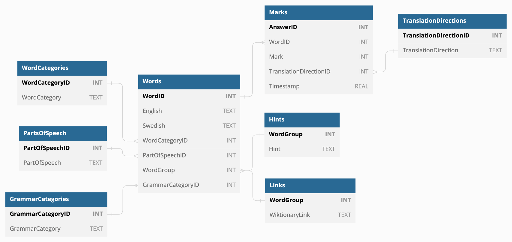

# Vocabulary Database

All words for the game are stored in a .db in this directory in file called `vocabulary.db`. This is also where a record of all answers is kept.

Below is a diagram of the database's structure and a summary of each table. This database structure can be created using the `database/create_db.py` script.

&nbsp;

## Answer

| Field Name | Data Type | Attributes | Description |
| ---------- | --------- | ---------- | ----------- |
| AnswerID | INTEGER | PRIMARY KEY, AUTOINCREMENT | Unique identifier for each submitted answer. |
| WordID | INTEGER | NOT NULL | ID for each word or phrase pair. |
| Mark | INTEGER | NOT NULL | 1 if the answer was the correct, 0 if not. |
| TranslationDirectionID | INTEGER | NOT NULL | ID for the translation direction. |
| Timestamp | FLOAT | NOT NULL | Unix timestamp of when the answer was submitted. |

&nbsp;

## GrammarCategory

| Field Name | Data Type | Attributes | Description |
| ---------- | --------- | ---------- | ----------- |
| GrammarCategoryID | INTEGER | PRIMARY KEY, AUTOINCREMENT | Unique identifier for the grammar category. |
| GrammarCategory | TEXT | NOT NULL | Description of the grammar category. These include the the types of adjectives (utrum, neutrum, plural), the different forms of a noun (singular and plural versions of definite and indefinite) etc. |

&nbsp;

## Hint

| Field Name | Data Type | Attributes | Description |
| ---------- | --------- | ---------- | ----------- |
| WordGroup | INTEGER | PRIMARY KEY, NOT NULL | The word group. |
| Hint | TEXT | NOT NULL | Context hint which is displayed along with the question to remove any ambiguity about the intended translation of the word or phrase. |

&nbsp;

## Link

| Field Name | Data Type | Attributes | Description |
| ---------- | --------- | ---------- | ----------- |
| WordGroup | INTEGER | PRIMARY KEY, NOT NULL | The word group. |
| WiktionaryLink | TEXT | NOT NULL | URL for the word group's wiktionary page. |

&nbsp;

## PartOfSpeech

| Field Name | Data Type | Attributes | Description |
| ---------- | --------- | ---------- | ----------- |
| PartOfSpeechID | INTEGER | PRIMARY KEY, NOT NULL | Unique identifier for the part of speech. |
| PartOfSpeech | TEXT | NOT NULL | The name of the part of speech, e.g. "noun", "verb", "adverb". |

&nbsp;

## TranslationDirection

| Field Name | Data Type | Attributes | Description |
| ---------- | --------- | ---------- | ----------- |
| TranslationDirectionID | INTEGER | PRIMARY KEY, NOT NULL | Unique identifier for the translation direction. |
| TranslationDirection | TEXT | NOT NULL | Description of the translation direction, e.g., "en to sv" or "sv to en". |

&nbsp;

## WordCategory

| Field Name | Data Type | Attributes | Description |
| ---------- | --------- | ---------- | ----------- |
| WordCategoryID | INTEGER | PRIMARY KEY, AUTOINCREMENT | Unique identifier for the word category. |
| WordCategory | TEXT | NOT NULL | The name of the word category. These categories are used to group words by theme, e.g., "sport", "food", "science" etc. |

&nbsp;

## Word

| Field Name | Data Type | Attributes | Description |
| ---------- | --------- | ---------- | ----------- |
| WordID | INTEGER | PRIMARY KEY, AUTOINCREMENT | Unique identifier for each word or phrase pair. |
| English | TEXT | NOT NULL | English part of the word or phrase pair. |
| Swedish | TEXT | NOT NULL | Swedish part of the word or phrase pair. |
| WordCategoryID | INTEGER | NOT NULL | ID for the word category. |
| PartOfSpeechID | INTEGER | NOT NULL | ID for the part of speech. |
| WordGroup | INTEGER | NOT NULL | Unique identifier for the word group a word or phrase belongs to. Inflections of the same word have unique WordIDs, but share the same word group. E.g., "a dog", "dogs", "the dog" and "the dogs" would have the same word group. |
| GrammarCategoryID | INTEGER | NOT NULL | ID for the grammar. |
